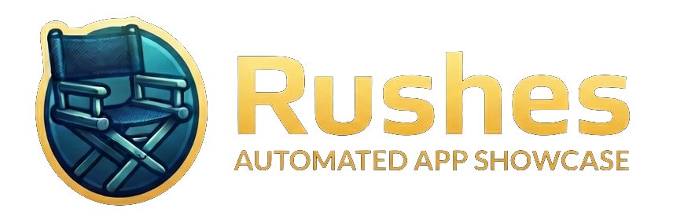
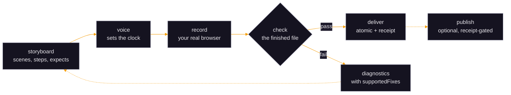
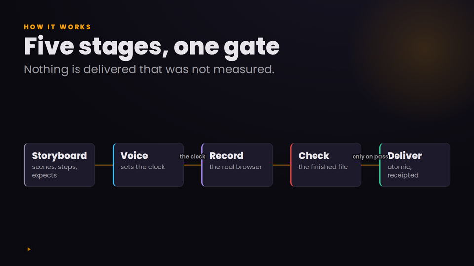
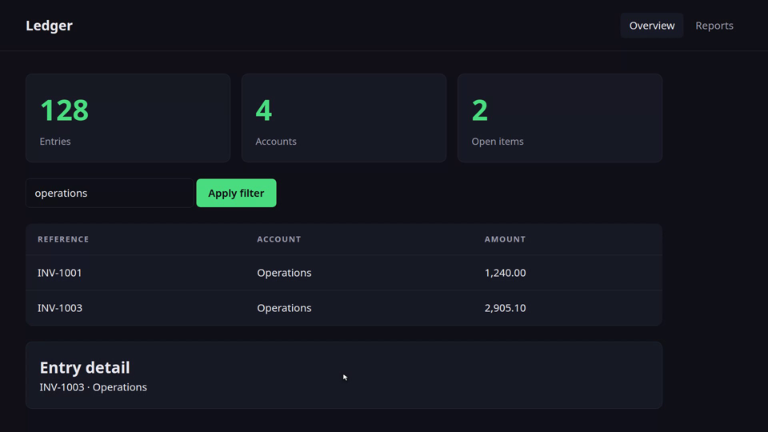

<div align="center">



**Point your coding agent at your web app. Get a narrated, captioned, verified demo video.**

[](LICENSE)
[](package.json)
[](.github/workflows/ci.yml)

```bash
npx skills add samugit83/rushes -g --all -y
```

</div>

---

Rushes turns a web application into a demo video. You describe the demo, your
coding agent writes a storyboard, and Rushes drives your real UI in a real browser,
narrates each scene, and cuts it together with captions and chapters. Then it
checks the result: every step resolved, every scene shows what the voice claims,
no dead air, no secrets on screen. If a check fails, nothing is delivered. Works
with Django, Rails, Next.js, or a static site. Two API keys, both for the voice.

## The whole journey, start to finish

One path. Every other command lives at the bottom, under
[Everything else](#everything-else); you do not need any of them to get a video.

**You will not be typing `rushes` commands.** You install it once, then you talk
to your coding agent and it runs them. Your part is answering five questions and
looking at four things.

---

### Step 1. Install it, once, from anywhere

```bash
npx skills add samugit83/rushes -g --all -y
```

> **Prefer to work from a clone?** Development, or any change you want to make to
> the skill itself, starts here instead:
> ```bash
> git clone https://github.com/samugit83/rushes.git ~/rushes && cd ~/rushes && npm install
> npm link                                             # gives you `rushes`
> mkdir -p ~/.claude/skills && ln -s ~/rushes ~/.claude/skills/rushes
> ```
> Everything from Step 2 onward is identical either way.

`-g` makes it global and `--all` answers every prompt, so **it does not matter
which directory you are in** and rushes is available in every project on your
machine. You never run this again. It lands in `~/.agents/skills/rushes`, with
`~/.claude/skills/rushes` pointing at it.

Two lines near the end will say `Eve does not support global skill installation`
and the same for `PromptScript`. That is expected: those two agents have no
global location, and every other agent installed fine.

**Then give yourself the command the rest of this README uses:**

```bash
alias rushes='node ~/.agents/skills/rushes/bin/rushes.mjs'
```

Put it in your `~/.bashrc` or `~/.zshrc`. Your coding agent does not need this,
it runs the entry point by path, but every `rushes ...` below is written for a
human at a shell.

> **Why there is no installed binary.** Rushes runs its TypeScript directly, with
> no build step, because Node strips the types at load time. Node deliberately
> refuses to do that for files under `node_modules/`, so `npm install -g` gives
> you a `rushes` command that dies with
> `ERR_UNSUPPORTED_NODE_MODULES_TYPE_STRIPPING`. A skill directory is not under
> `node_modules`, which is why the alias works and an npm install does not.

The first run installs the skill's own dependencies, once, into its own
directory. Nothing else to do.

### Step 2. Let it set itself up

```bash
rushes setup
```

It checks what is needed, installs what it can, and tells you the rest:

```text
  checking what Rushes needs
    ✓ node     v22.11.0
    · ffmpeg   not found
    · browser  not found

  installing the browser, into a cache in your home (no privileges needed)
    npx --yes playwright install chromium
    ✓ done

  ffmpeg is a system package, so this one is yours to run:

      sudo apt install -y ffmpeg

  Rushes will not run a privileged command on your behalf: you asked it to
  set itself up, which is not the same consent as installing system packages.
```

Copy that one line, run it, and run `rushes setup` again. It will say:

```text
  ✓ everything Rushes needs is installed.
```

**Why it installs one and not the other.** The browser goes into a cache
directory in your home and needs no privileges, so setup fetches it. ffmpeg is a
system package, and a tool that runs `sudo` because you typed an unrelated
command is executing things you never read. The command it prints is the exact
one for the package manager you actually have, not a guess from your OS family.

*(`rushes doctor` is the read-only version: it reports and changes nothing.)*

### Step 3. Give it a voice

Two keys from [ElevenLabs](https://elevenlabs.io), exported like any other
environment variable. Put them in your `~/.bashrc` or `~/.zshrc` so you never do
this again:

```bash
export ELEVENLABS_API_KEY=sk_your_key_here
export ELEVENLABS_VOICE_ID=your_voice_id
```

**Nothing else is ever a secret you give to Rushes.** Your application's own
password or token is never stored here, see [Safety and privacy](#safety-and-privacy).

### Step 4. Go to your app and start your agent

```bash
cd ~/code/my-app
claude
```

Your app should be running, the way you normally run it.

### Step 5. Ask for the video in ordinary words

Type this into the chat. That sentence is what starts everything:

> make a demo video showing how the reports page works

### Step 6. Answer five questions

The agent asks all five at once, then does the work. Here is a real exchange:

```text
You    make a demo video showing how the reports page works

Claude Five things before I start:

       1. What should a viewer be able to do or understand when it ends?
       2. Where is the app, and is it already running?
       3. How should I sign in?
          - it is public, no sign-in
          - I will sign in myself once, now   <- recommended
          - there is a login form; here are throwaway credentials
          - a token from an environment variable I already export
       4. Which account or tenant should I record, and is everything
          visible in it safe to publish?
       5. How long, and who is watching?

You    1. that they can filter by month and export a CSV
       2. http://localhost:8000, it is running
       3. I will sign in myself
       4. the demo tenant, yes it is all seeded fake data
       5. about 3 minutes, for a developer evaluating us

Claude I need you to sign in once. Run this and log in as you normally
       would - I never see your password:

           rushes login

You    (a browser opens, you log in, you press Enter, done)
       ok done
```

That `rushes login` is **the one command you type yourself**, and only if your
app needs a sign-in. A browser opens, you log in however you normally do (password
manager, 2FA, SSO), and the session is saved. Every later recording is
unattended.

### Step 7. Approve four things

The agent stops and waits at each of these. Nothing happens until you reply.

```text
Claude GATE 1 - here is what I understood:
         app        http://localhost:8000, signed in as demo@acme.test
         palette    extracted from your app: bg #0f1117, accent #4ade80,
                    font Inter
         shape      demo-led, 7 scenes, ~3 min, dark, calm explainer
         assuming   1920x1080 at 30fps, captions as sidecars,
                    publishing OFF
       Correct anything.

You    good, but say "monthly report" not "report page"

Claude GATE 2 - the outline:
         1  [live]              the reports list
         S1 [composed/flow-row] how a report is built: 4 steps
         2  [live]              filtering by month
         3  [live]              exporting a CSV
       Approve, or tell me what to change.

You    approved

Claude GATE 2.5 - here is every slide as a picture, before I spend
       anything: ./out/reports-tour/slides-preview/contact-sheet.html

You    slide 1 is too dense, drop the last box

Claude Done. Building now - this takes about 8 minutes.
```

Then it works. Voice, browser, recording, checks.

```text
Claude GATE 3 - done. 21/21 showcase, 0 errors, 1 warning.

         video      out/reports-tour/reports-tour.mp4  (3m04s)
         thumbnail  out/reports-tour/reports-tour.thumb.png
         frames     out/reports-tour/evidence/contact-sheet.html
         captions   out/reports-tour/subtitles/reports-tour.vtt

       rehearsal: agreed. frame evidence: passed.
       7 scenes verified against the narration.

       NOT published. Watch it, then tell me if you want it up.
```

### Step 8. Watch it

Your video is in your project, under `out/<demo-id>/`:

```bash
xdg-open out/reports-tour/reports-tour.mp4     # Linux
open out/reports-tour/reports-tour.mp4         # macOS
```

What is in that folder:

| File | What it is |
|---|---|
| `reports-tour.mp4` | **the video** |
| `reports-tour.thumb.png` | a 1280x720 thumbnail |
| `subtitles/*.vtt` and `*.srt` | captions, never burned into the picture |
| `reports-tour.youtube.txt` | title and description, with chapters |
| `reports-tour.linkedin.txt` | a ready-to-paste post |
| `evidence/contact-sheet.html` | one frame per scene, from the delivered file |
| `receipt.json` | what was checked, and the hashes binding it to the storyboard |

**This is a finished outcome.** If you only wanted a video, you are done.

### Step 9. Put it on YouTube

Only if you want to. Publishing is absent until you set it up, and it takes
three things, once.

**9a. Get a Google OAuth client.** In the
[Google Cloud console](https://console.cloud.google.com/apis/credentials):
enable the *YouTube Data API v3*, then **Create credentials → OAuth client ID →
Desktop app**, and download the JSON. Put it in your project:

```bash
mkdir -p credentials
mv ~/Downloads/client_secret_*.json credentials/client_secret.json
```

**9b. Authorise once.**

```bash
rushes publish-auth
```

It prints a URL, you approve in the browser, and the token is saved.

**9c. Tell your config where videos go.** Add this to `rushes.config.json`:

```jsonc
{
  "publish": {
    "youtube": {
      "titlePrefix": "Acme - ",
      "privacy": "unlisted",
      "tags": ["Acme", "demo"]
    }
  }
}
```

**9d. Then just ask.** In a **new message**. This is deliberate: approving the
video is not approving an upload.

```text
You    publish it, unlisted

Claude Uploading reports-tour, privacy unlisted.
       ✓ uploaded: https://youtu.be/dQw4w9WgXcQ
         set custom thumbnail
         uploaded caption track (en)
       LinkedIn post ready with the real link:
         out/reports-tour/reports-tour.linkedin.txt
```

The upload **refuses** unless all five hold: a receipt exists, it was produced at
the showcase profile, it recorded zero errors, and both the storyboard hash and
the video hash still match the bytes on disk. Edit the storyboard after recording
and the publish is refused, because the chapter timestamps would no longer match
the video.

---

## How it works



The loop from `check` back to the storyboard is the part that is different. Every
failure is structured data, a stable code, the exact subject, the measured
evidence, and an enumerated list of repairs, so the agent that wrote the
storyboard can converge instead of guess.

## Why this is different

Twenty-five projects can drive a browser and call a text-to-speech API. Here is
what happens after the file exists.

**A receipt binds the video to the storyboard that produced it.**

```jsonc
{
  "profile": "showcase",
  "storyboard": { "sha256": "9f2c…", "bytes": 8412 },
  "artifact":   { "sha256": "b71a…", "durationMs": 172400 },
  "summary":    { "errors": 0, "warnings": 1, "checks": "21/21" },
  "rehearsal":      { "status": "agreed", "passes": 2 },
  "frameEvidence":  { "status": "passed", "frames": 10 },
  "narrationCheck": { "verified": 10, "unverified": 0, "inconclusive": 0 },
  "humanReview":    { "status": "pending", "reviewer": null }
}
```

Publishing refuses unless the profile is `showcase`, the errors are zero, and
**both hashes still match the bytes on disk**. Edit the storyboard after
recording and the publish is refused, because the chapter timestamps would no
longer match the video.

**A failed run refuses, and says exactly what to do.** This is a real refusal,
from the bundled fixture recorded with the local silent voice at the publishable
profile:

```text
  ✗ audio_present
      mean volume -91 dB
  ✓ privacy_clean
  ✓ never_show_clean
  ✓ egress_policy
  ✓ external_credential_free
  ✓ file_scope
  ✓ secret_scrub
  28/31 showcase, 2 errors, 1 warnings

checks failed: nothing was delivered, and the previous artifact is untouched.

  ✗ audio/silent-track                 mean volume -91 dB is outside the usable band
      at   artifact=out/tour/.staging-RDYfQ6/tour.mp4
      meanDb: -91
      fix: check the narration clips mixed in
      fix: re-run the mux
```

A locator failure reads the same way, and carries the frame it was looking at:

```text
  ✗ step/locator-unresolved            waiting for getByText('Apply filters')
      at   sceneId=filter stepIndex=2 do=click
      screenshot: out/tour/evidence/fail-filter-2.png
      url: http://localhost:8000/reports
      visibleAlternatives: ["Apply filter","Clear filters","Filter by account"]
      fix: use "text": "Apply filter"
      fix: use "role": "button", "name": "Apply filter"
```

**`human_review` stays `pending` until a person says they watched it.** It is
never inferred and never claimed on their behalf. `skipped` means a tool was
unavailable, and never that a check passed.

## Works with any framework

Not a claim, a suite. Each fixture is a small server that reproduces a SHAPE,
and the engine drives all of them with one storyboard vocabulary and no
framework detection anywhere.

| Fixture | Auth | Readiness | Proves |
|---|---|---|---|
| static site | `none` | full page load | no framework at all |
| server-rendered + CSRF form login | `form-login` | one paint | the Django / Rails / Laravel shape |
| client-hydrated shell | `none` | hydration settle | the SPA shape: content after a fetch |
| an app that never settles | `none` | never | `readiness/timeout` fires instead of filming a spinner |

```bash
node test/run.mjs conformance
```

Readiness is measured, never waited out: `readyState`, then network quiet, then
no running animation, then optionally the app's own busy selector. There is no
`if (isNextJs)` anywhere in the engine, and a test greps for it.

## Two registers, one video

A Rushes video alternates designed slides that explain a concept with the live
application filmed proving it. Slides carry the idea; the app carries the
evidence.

| A designed slide | The live app |
|---|---|
|  |  |

Slides are authored as JSON blocks whose connectors are **measured after layout**
rather than predicted, or as free HTML when a slide has no topology. Both pass
the same rendered-output checks: the safe area, the type floor, the contrast
ratio, the embedded face, and every declared beat firing. Slide beats anchor to
**words in the narration**, so re-recording with a different voice re-syncs every
beat with no storyboard edit.

`rushes slides preview` renders every slide to a PNG with no voice, no recording
and no ffmpeg, seconds, and no spend. That is where a design is corrected, not
inside a finished video.

## Everything else

Nothing below is needed for [the journey above](#the-whole-journey-start-to-finish).
This is the escape hatch: what to run when you want to drive it yourself, or when
something needs checking.

### Try it with no app and no configuration at all

```bash
rushes demo
```

Rushes ships a small example application, a pretend accounting page. This starts
it on a free port, waits until it answers, films it, and stops it again. A real
MP4 lands in `./rushes-demo/out/tour/` in about two minutes. Worth running once
after installing, to prove your machine is set up before your own app is
involved.

### When something is not working

```bash
rushes doctor
```

Prints what is missing (Node, ffmpeg, a browser, the voice keys) and the one
command that installs each. Run this first, always.

### Driving it yourself

The agent runs these for you. You can run them too:

<!-- generated:commands -->
| Command | What it does |
|---|---|
| `rushes setup                              ` | check what is needed and install what can be installed |
| `rushes demo [dir]                         ` | record a video of the bundled example app; no configuration at all |
| `rushes doctor                             ` | check node, ffmpeg, chrome, the browser engine and the optional keys |
| `rushes init                               ` | probe the app and scaffold rushes.config.json |
| `rushes login                              ` | sign in by hand once, headed, and save the browser state |
| `rushes discover <id>                      ` | walk the app and draft a storyboard with expects pre-filled |
| `rushes validate <id>                      ` | schema, lint, and a live dry run of every step and expect |
| `rushes rehearse <id>                      ` | two silent passes; they must agree before you record |
| `rushes build <id>                         ` | voice, record, compose and check into a staging directory |
| `rushes deliver <id>                       ` | build, then commit atomically on pass and write the receipt |
| `rushes evidence <id>                      ` | keyframes and the narration check, from the DELIVERED mp4 |
| `rushes recut <id>                         ` | re-compose from the recording and the timeline; no re-record |
| `rushes rerun <id>                         ` | re-record and report, per scene, what changed since the last delivery |
| `rushes score <id>                         ` | an advisory score sheet: pacing, motion, reading rate. Not a gate |
| `rushes formats <id>                       ` | a GIF, a vertical crop and editor stems from the same capture |
| `rushes slides <build|check|preview|tokens>` | compile, measure, screenshot or derive the slide deck |
| `rushes check <id>                         ` | run the checker against what is already on disk |
| `rushes status                             ` | the catalogue: what was built, published, and has since drifted |
| `rushes publish <id>                       ` | optional; refuses without a passing receipt |
| `rushes publish-auth                       ` | optional; one-time OAuth for the upload module |
| `rushes clean <id>                         ` | sweep intermediates; deliverables are never touched |
| `rushes help [command]                     ` | this list |
<!-- /generated:commands -->

The three worth knowing: `validate` checks a storyboard against your live app and
costs nothing, `rehearse` runs it twice silently and refuses if the two passes
disagree, and `deliver` is the only one that spends anything.

### Writing the config by hand

Three lines is a valid config:

```jsonc
{ "baseUrl": "http://localhost:8000" }
```

Then auth, in the order of how many people need each rung:

```jsonc
{ "auth": { "kind": "none" } }                              // a public site

{ "auth": { "kind": "storage-state" } }                     // most people
// then: rushes login , sign in by hand once, headed, however your app requires

{ "auth": { "kind": "form-login", "path": "/accounts/login/",
            "fields": { "username": "${DEMO_USER}", "password": "${DEMO_PASS}" },
            "csrfField": "csrfmiddlewaretoken" } }
```

`jwt-cookie`, `basic` and `header` are there too. Everything else, readiness,
seeding, dismissers, branding, redaction, external navigation, publishing, is in
[`references/config-contract.md`](references/config-contract.md).

`rushes init` probes your app and scaffolds the file with what it can detect.


## What gets checked

<!-- generated:checks -->
| Check | Measures | standard | showcase |
|---|---|---|---|
| `storyboard_schema` | schema + cross-field lint | **error** | **error** |
| `config_valid` | project config passes its schema and every ${VAR} resolves | **error** | **error** |
| `steps_resolved` | zero step/* errors in problems.json | warn | **error** |
| `scene_expects` | every scene expect satisfied | warn | **error** |
| `rehearsal_agreed` | the two rehearsal passes matched | ignore | **error** |
| `timeline_complete` | every scene present, monotonic, non-overlapping | **error** | **error** |
| `narration_covered` | every scene has audio; audio fits the scene | **error** | **error** |
| `dead_air` | per-scene gap at or under 8s | warn | **error** |
| `audio_present` | volumedetect mean between -30 and -6 dB | warn | **error** |
| `audio_loudness` | integrated loudness -18..-14 LUFS | ignore | warn |
| `video_stream` | resolution, fps and duration as configured | **error** | **error** |
| `no_black_scene` | scene midpoint keyframe not uniformly dark | ignore | **error** |
| `captions_aligned` | cues exist; the last cue ends before the video does | warn | **error** |
| `caption_reading_rate` | no cue over ~20 characters per second | ignore | warn |
| `privacy_clean` | no secret or PII pattern in captured visible text | **error** | **error** |
| `never_show_clean` | no never-show term in narration, captions or evidence | **error** | **error** |
| `assert_metrics` | every assert satisfied against live data | **error** | **error** |
| `youtube_meta` | title within the limit; chapters 3+ or none; no orphan labels | warn | **error** |
| `narration_check` | zero unverified scenes from the vision check | ignore | **error** |
| `slide_font_embedded` | computed font-family is the embedded face on every slide | **error** | **error** |
| `slide_no_overflow` | no block whose scrollWidth exceeds its clientWidth | **error** | **error** |
| `slide_safe_area` | no element outside the frame | **error** | **error** |
| `slide_min_font` | no rendered text below the size floor | warn | **error** |
| `slide_contrast` | every text/background pair at or above 4.5:1 | warn | **error** |
| `slide_beats_fired` | every declared beat fired before the scene ended | warn | **error** |
| `slide_word_count` | words per slide under the ceiling | ignore | warn |
| `slide_edge_through_node` | no connector runs through a box it does not connect | **error** | **error** |
| `slide_route_composition` | no unrelated connectors cross or share a corridor | warn | **error** |
| `slide_label_clearance` | no connector label covers a box, a route or another label | ignore | warn |
| `slide_projected_readability` | the smallest text still readable once projected into a video player | ignore | warn |
| `slide_authored_fidelity` | authored slides stay on the project palette and face (L18) | ignore | warn |
| `slide_source_truth` | generated slide content matches the repo it was derived from | **error** | **error** |
| `slide_golden` | rendered slide matches its checked-in golden PNG | ignore | warn |
| `publish_consent` | the publish-safety question was answered yes and recorded | **error** | **error** |
| `recording_identity` | the recording identity is dedicated, not an operator account | **error** | **error** |
| `egress_policy` | every host contacted, and every redirect hop, passed the resolved-IP classification | **error** | **error** |
| `external_allowlisted` | every off-origin navigation named a host in external.allow | **error** | **error** |
| `external_credential_free` | no external request carried a header or basic credential | **error** | **error** |
| `file_scope` | every file:// target lay inside the compiled slide directory | **error** | **error** |
| `no_pending_restore` | no leftover .rushes/pending-restore.json | **error** | **error** |
| `receipt_auditable` | every auditable receipt field is present and non-empty | **error** | **error** |
| `secret_scrub` | no resolved secret value appears in any diagnostic, receipt or log | **error** | **error** |
| `env_allowlist` | the skill's .env carries only the two voice keys | **error** | **error** |
| `auth_effective` | the app is signed in after the auth strategy ran | **error** | **error** |
| `engine_neutral` | no product-specific identifier appears in lib/, bin/ or schemas/ | ignore | **error** |
<!-- /generated:checks -->

## Safety and privacy

This is a browser-driving tool that handles credentials and can publish
publicly, so the constraints are stated out loud rather than assumed.

- **Two environment variables, both for the voice.** Rushes never stores another
  system's secret. A build fails if its own `.env` grows a third key.
- **Auth is a browser state file you captured, or an env var you already export.**
  `rushes login` opens a headed browser, you sign in, and the skill never sees
  the credential. The state file is written `0600` and can never enter the
  packaged payload.
- **Every host is classified on its resolved IP**, not its name, with every
  redirect hop re-checked and the passing address pinned for the connection.
- **Leaving your app's origin strips credentials**, and `file://` is confined to
  the compiled slide directory. Neither is configurable.
- **Every frame is scanned** for key-shaped strings and for your own never-show
  list, and a hit is an error at every quality profile.
- **A command in a config never auto-runs.** It is printed with its working
  directory and the config's sha256, and approval is recorded against that hash,
  so any edit invalidates it.
- **Publishing is absent unless configured**, gated on `--confirm` and on a
  receipt whose hashes still match the bytes on disk.
- **No telemetry.** Nothing is reported anywhere, ever.

Full model: [`SECURITY.md`](SECURITY.md).

## Honest limitations

- **Browser only.** Native and desktop applications are a different product.
- **Needs ffmpeg and a Chrome or Chromium binary.** Rushes detects and instructs;
  it never downloads a browser.
- **The voice costs real characters** unless you use the local provider, which is
  silent and good only for timing.
- **A storyboard is authored per demo.** It does not write itself yet.
- **The narration check needs a model with image input.** Without one, every
  scene is reported `inconclusive`, which is reported, not hidden.
- **No free-form node-and-edge diagrams.** Composed slides cover topologies with
  a known shape. If a diagram genuinely needs arbitrary placement and crossing
  edges, film the real application instead; it is more truthful than a drawing
  of it anyway.

## Versions

<!-- generated:versions -->
| | |
|---|---|
| version | `1.0.7` |
| node | `>=22.6.0` |
| license | `MIT` |
| dependencies | `ajv@8.20.0`, `ajv-formats@3.0.1`, `playwright@1.62.1` |
| optional | `googleapis@144.0.0` |
<!-- /generated:versions -->

## Contributing

See [`CONTRIBUTING.md`](CONTRIBUTING.md). The short version: the engine knows
nothing about the app it films, readiness is measured rather than waited out, and
a check fails closed unless it is on a named exception list. All three are
enforced by tests.

MIT licensed.
