# Rushes — Technical Reference

How the pipeline actually works, stage by stage, in code.

`README.md` explains what to type. `docs/ARCHITECTURE.md` is the one-page map.
This document is the long form: every stage of the pipeline, what the agent
does versus what the program does, how the validation layers are built, and
where each decision lives in the source.

---

## Table of contents

1. [The one idea](#1-the-one-idea)
2. [Runtime shape: no build step, one entry point](#2-runtime-shape-no-build-step-one-entry-point)
3. [Two actors: the agent and the CLI](#3-two-actors-the-agent-and-the-cli)
4. [The data model](#4-the-data-model)
5. [The command surface](#5-the-command-surface)
6. [The delivery pipeline, stage by stage](#6-the-delivery-pipeline-stage-by-stage)
7. [The engine: one boot path](#7-the-engine-one-boot-path)
8. [Step execution and locator resolution](#8-step-execution-and-locator-resolution)
9. [Readiness: "settled" as a measurement](#9-readiness-settled-as-a-measurement)
10. [Egress, navigation and the credential boundary](#10-egress-navigation-and-the-credential-boundary)
11. [The voice is the clock](#11-the-voice-is-the-clock)
12. [The slide subsystem](#12-the-slide-subsystem)
13. [The recorder and the timeline](#13-the-recorder-and-the-timeline)
14. [Composition: captions, cards, mux](#14-composition-captions-cards-mux)
15. [Validation: three tiers, one registry](#15-validation-three-tiers-one-registry)
16. [Atomic delivery, the receipt and the publish gate](#16-atomic-delivery-the-receipt-and-the-publish-gate)
17. [The diagnostic protocol and the repair loop](#17-the-diagnostic-protocol-and-the-repair-loop)
18. [The security model](#18-the-security-model)
    - [18b. Portability: one file knows about the OS](#18b-portability-one-file-knows-about-the-os)
19. [Tests, CI and packaging](#19-tests-ci-and-packaging)
20. [Sharp edges found while reading the code](#20-sharp-edges-found-while-reading-the-code)
21. [Where a change goes](#21-where-a-change-goes)

---

## 1. The one idea

> **An artifact nobody measured is not delivered.**

Everything structural follows from that sentence. A large-language-model agent
writes the storyboard, so the authoring step is nondeterministic. The pixels
come from live software, so the recording step is nondeterministic too. The
program's job is not to trust either one: it is to **measure the finished mp4**
and refuse to hand it over if the measurement disagrees with what was claimed.

Three invariants encode it:

| Invariant | Where it lives | Why |
|---|---|---|
| **One boot path** | [`lib/engine/session.ts`](../lib/engine/session.ts) `boot()` | `validate`, `rehearse`, `build`, `deliver` and `slides tokens` all open the app the same way. A validator that boots differently from the recorder produces steps that pass in the check and fail in the take. |
| **The voice is the clock** | [`lib/compose/tts.ts`](../lib/compose/tts.ts) → [`lib/engine/driver.ts`](../lib/engine/driver.ts) | TTS runs first; each clip's measured duration is the floor for its scene. The picture stretches to the voice, never the reverse, so narration can never be cut off. Caption offsets, chapter stamps and beat firing all derive from that one number. |
| **Nothing is delivered that was not measured** | [`lib/check/deliver.ts`](../lib/check/deliver.ts) + [`lib/check/index.ts`](../lib/check/index.ts) | The build composes into a staging directory from a frozen storyboard snapshot; the checker measures the **staged** file; only a pass earns the `rename()`. |

---

## 2. Runtime shape: no build step, one entry point

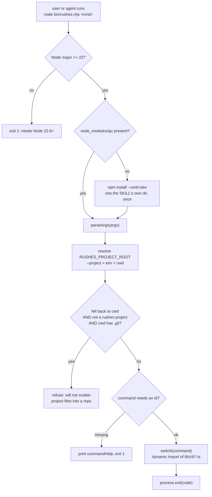

Key facts:

- **The `lib/` tree is TypeScript that is never compiled.** Node ≥ 22.6 strips
  types at load time, so there is no build artifact to keep in sync with the
  source. `tsconfig.json` is `noEmit: true` with `erasableSyntaxOnly` — the
  type-check is a lint, not a build.
- **Three runtime dependencies**: `ajv`, `ajv-formats`, `playwright`.
  `googleapis` is an *optional* dependency, imported dynamically and only when
  a project configures publishing.
- **Every subcommand is a dynamic `import()`** from
  [`bin/rushes.mjs`](../bin/rushes.mjs). Running `doctor` never loads the mux;
  running `slides preview` never loads the uploader.
- **The skill is installed once and films many projects.** Every path resolves
  against `RUSHES_PROJECT_ROOT` ([`lib/paths.ts`](../lib/paths.ts)), never
  against the skill directory. The only things stored under the skill are the
  TTS cache (`cache/audio/`) and the two voice keys in `.env`.

### On-disk layout

```
<skill root>/                     installed once
  bin/rushes.mjs                  the only entry point
  lib/                            the engine (TypeScript, never compiled)
  lib/platform.ts                 the only file that knows which OS this is
  schemas/                        3 JSON Schemas, additionalProperties:false
  slides/runtime/                 tokens.css, blocks.css, deck.js, Poppins woff2
  cache/audio/<sha1>.mp3          TTS cache, shared across all projects
  .env                            ELEVENLABS_API_KEY + ELEVENLABS_VOICE_ID only

<project root>/                   one folder per filmed app
  rushes.config.json              how to reach and sign into the app
  demos/<id>.demo.json            one storyboard per video
  slides/src/<id>.slide.json      slide sources (authoring input)
  slides/deck.html                COMPILED artifact, regenerated every build
  slides/golden/<id>.png          pinned reference frames
  slides/runtime/tokens.css       optional palette extracted from the live app
  .rushes/state.json              browser storage state, 0600
  .rushes/consent.json            runner approvals, keyed by config sha256
  .rushes/pending-restore.json    crash-safety for preflight mutations
  out/index.json                  the catalogue
  out/<id>/                       everything for one video
    recording.webm  timeline.json  problems.json  receipt.json
    intro.mp4  body.mp4  outro.mp4          (intermediates)
    <id>.mp4  <id>.thumb.png  <id>.youtube.txt  <id>.linkedin.txt
    subtitles/<id>.vtt  subtitles/<id>.srt
    evidence/*.png  evidence/contact-sheet.html
    slides-preview/*.png
    .staging-XXXX/                          (transient, atomic commit)
```

---

## 3. Two actors: the agent and the CLI

Rushes is a **skill**: it is designed to be driven by a coding agent (Claude),
not typed by a human. The division of responsibility is strict, and it is the
reason the tool works with a nondeterministic author.

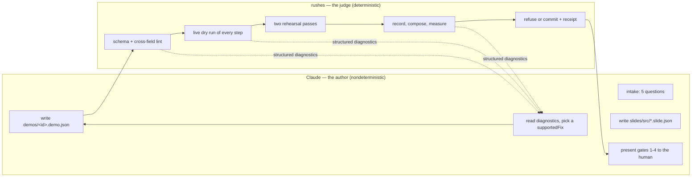

**What Claude does** (rules in [`SKILL.md`](../SKILL.md)):

| Responsibility | Detail |
|---|---|
| Intake | Exactly five questions, asked once, as one block. Question 4 — *"is everything visible safe to publish?"* — is a hard stop; anything short of a clear yes means propose a seeded tenant and **do not record**. |
| Discovery over asking | Routes, page titles, palette, font, busy selector, cookie banners, framework and the live value behind any factual claim are **discovered by looking** (`rushes discover`, `rushes init`, `rushes slides tokens`). Asking for one of them is defined as a defect in the skill file. |
| Authoring | Writes the storyboard JSON and slide sources. Instructed to read only `schemas/storyboard.schema.json`, `examples/demos/tour.demo.json` and the config contract before the first candidate — **not** `lib/`, because running `rushes validate` is faster than guessing what the engine accepts. |
| Repair | Reads `problems.json` / `--json` output, changes **only the diagnosed subject**, applies **one fix at a time**, and picks that fix **from `supportedFixes`** — never inventing a value. |
| Stopping | Continues while the objective error count reaches a new minimum; if two consecutive rounds do not improve the best count, it stops and reports the unresolved diagnostics truthfully. |
| Reporting | Emits a fixed-field handoff receipt and never claims more than was measured. `human_review` stays `pending` unless a person says they watched it; `skipped` means a tool was unavailable and never that a check passed. |

**What the CLI does**: everything falsifiable. It never repairs a storyboard,
never rewrites narration, and never publishes without an explicit new
instruction.

### The four gates

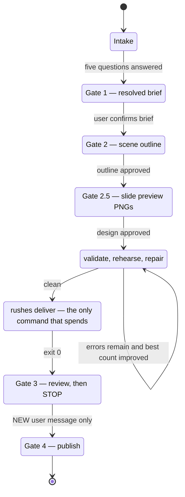

Two hard rules encoded in the workflow: **never deliver and publish in the same
turn**, and **never treat silence, ambiguity or approval of the outline as
consent to publish**.

---

## 4. The data model

Four JSON documents and one binary carry the whole pipeline.

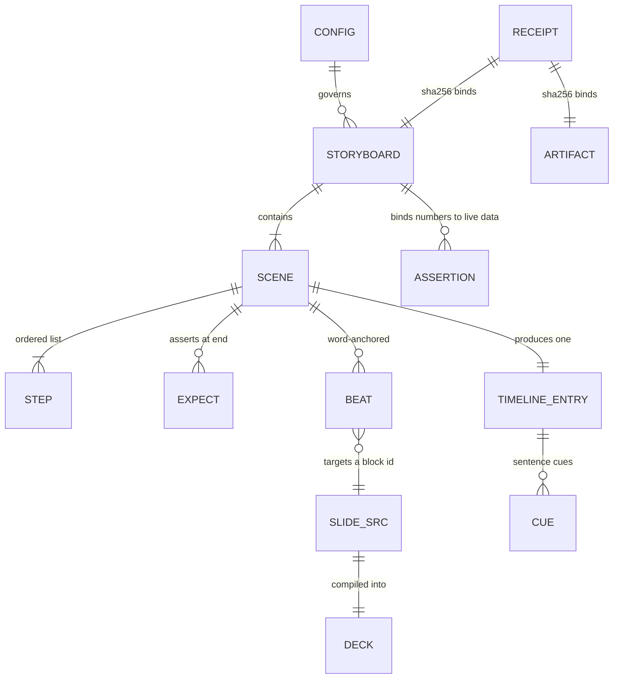

### `rushes.config.json` — how to reach the app

Schema: [`schemas/config.schema.json`](../schemas/config.schema.json). Loader:
[`lib/projectConfig.ts`](../lib/projectConfig.ts). **Only `baseUrl` is
required**; a missing file is not an error (defaults film
`http://localhost:3000` with no auth).

Notable blocks: `auth` (six strategies), `readiness` (quiet/timeout/ready/busy
selectors), `runner` (start command + readiness probe), `preflight`
(pre-state HTTP), `dismiss` (cookie walls), `seed` (localStorage / cookies),
`external` (off-origin allowlist), `redact` / `neverShow`, `brand`, `video`,
`pronunciation`, `publish.youtube`.

`${VAR}` interpolation is expanded from the **ambient** environment
(`resolveEnvRefs`), keys included, and an unset variable becomes a
`config/env-ref-unresolved` error rather than an empty string. Expansion
deliberately does *not* register values with the secret scrubber — that would
redact `baseUrl` out of the receipt, and the receipt exists to answer "which
target was filmed". Registration happens at the **secret positions** instead:
each auth strategy registers its own secret, cookie values and minted token.

### `demos/<id>.demo.json` — the storyboard

Schema: [`schemas/storyboard.schema.json`](../schemas/storyboard.schema.json).
Types: [`lib/types.ts`](../lib/types.ts). Lint:
[`lib/storyboard.ts`](../lib/storyboard.ts).

```jsonc
{
  "schemaVersion": 1,
  "id": "tour",                  // namespaces out/<id>/
  "feature": "the entry ledger", // thumbnail + fallback title
  "scope": "...",                // free-form tenant label, receipted
  "seed":   { "key": "value" },  // extra localStorage before app scripts run
  "prep":   [ /* Steps, off the clock, not narrated */ ],
  "redact": [ ".customer-name" ],// selectors blurred in-page before the clock
  "assert": [ { "metric": "...", "endpoint": "/api/x", "jsonPath": "a.b",
                "min": 1000, "because": "the voice says 'over a thousand'" } ],
  "opening": { "kicker": "", "title": "", "subtitle": "",
               "disclaimer": "", "narration": "" },
  "scenes": [ {
    "id": "overview",            // stable slug; audio cache salt; chapter key
    "narration": "...",          // spoken AND captioned
    "steps": [ /* … */ ],
    "expect": [ { "text": "Entries" } ],
    "beats":  [ { "on": "broker", "do": "focus", "target": "bus" } ],
    "minHoldMs": 4000, "tailPadMs": 600, "volatile": false
  } ],
  "closing": { "title": "", "subtitle": "", "narration": "" },
  "youtube": { "title": "", "summary": "", "hook": "",
               "chapterLabels": { "overview": "The overview" }, "linkedin": "" }
}
```

**The step vocabulary** (`StepKind` in `lib/types.ts`, argument rules in
`STEP_ARGS` in `lib/storyboard.ts`, execution in
[`lib/engine/actions.ts`](../lib/engine/actions.ts)):

| Step | Required args | Forbidden args | What it does |
|---|---|---|---|
| `goto` | one of `path` \| `external` | `value keys factor dx` | same-origin navigation, or a declared off-origin visit |
| `slide` | `slide` | `path value keys factor` | hash-route the compiled deck; no page load |
| `click` | a locator | `value keys factor path` | glide cursor, click, settle |
| `clickCanvas` | — (`strategy`, `confirm`) | `value keys factor` | pixel-strategy click inside a canvas, confirmed by a locator |
| `hover` / `moveTo` | a locator | `value keys factor path` | glide the synthetic cursor |
| `type` | `value` + locator | `keys factor` | focus, clear, type at `typeDelayMs` cadence |
| `press` | `keys` | `value factor` | keyboard press |
| `scroll` | `dy` | `factor value keys` | wheel-scroll a locator or the page |
| `drag` | one of `dx` \| `dy` | `factor value keys` | press–move–release; pans canvases |
| `zoom` | `factor` | `dy dx value keys` | ctrl+wheel over a locator |
| `highlight` | a locator | `value keys factor path` | draw a focus ring and hold |
| `waitFor` | a locator | `value keys factor path` | gate on real app state |
| `wait` | `ms` | — | idle |

**Locator priority is `text` > `role`+`name` > `testId` > `css`, and that order
is the point** — a storyboard written against visible text and ARIA roles
survives a refactor that renames every class. `css` works and is last; the
linter emits `storyboard/css-over-semantic` when a *semantic target* step
(`click`, `hover`, `moveTo`, `type`, `highlight`) reaches for a raw selector.
A `drag` or `zoom` on a canvas is exempt, because a canvas has no role by
construction and warning every time trains the reader to ignore the warning.

### `slides/src/<id>.slide.json` — a slide source

Schema: [`schemas/slide.schema.json`](../schemas/slide.schema.json). Types:
[`lib/slides/types.ts`](../lib/slides/types.ts).

Two modes, and neither is a fallback for the other:

- **`composed`** — declares a `block` (one of thirteen), `items`, and optional
  `connectors`. The source carries **no coordinates at all**; a `x`, `y`,
  `col`, `row`, `via`, `left`, `top` or `position` key anywhere in the file is
  a `slide/coordinate-in-source` error. Geometry follows from the block and the
  item count.
- **`authored`** — raw `html` + `css`. Free-form input, but the *rendered
  result* is measured by exactly the same checks.

Each block declares a **capacity** (`CAPACITY` in `lib/slides/types.ts`).
Exceeding it is treated as an editorial problem, not a layout one:

| block | cap | | block | cap | | block | cap |
|---|---|---|---|---|---|---|---|
| `title` | 1 | | `sequence` | 8 | | `badge-list` | 12 |
| `bullets` | 6 | | `ring` | 4 | | `metric` | 3 |
| `flow-row` | 8 | | `compare` | 3 | | `code` | 1 |
| `hub` | 8 | | `stack` | 6 | | `quote` | 1 |
| `store` | 3 | | | | | | |

### `out/<id>/timeline.json` — the recorded clock

```jsonc
{ "durationMs": 173400, "leadTrimMs": 4820, "introDurationMs": 7400,
  "timeline": [ {
    "sceneId": "overview", "startMs": 0, "endMs": 14200,
    "narration": "…", "audioPath": "…/ab12.mp3", "audioDurationMs": 12800,
    "steps": [ { "do": "goto", "ms": 1830 }, { "do": "highlight", "ms": 1620 } ],
    "actionEndMs": 5300          // where the steps finished → freeze point
  } ] }
```

Every downstream stage reads this file: captions, chapters, the freeze filter,
evidence extraction, the score sheet and `rushes check`.

### `out/<id>/receipt.json` — what was built, from what, measured how

Shape and rules in [`lib/check/receipt.ts`](../lib/check/receipt.ts). It exists
so two questions have answers after the fact: *"is this mp4 the one that passed
the checks?"* (artifact sha256) and *"which target was filmed, as whom, with
whose approval?"* (resolved baseUrl + resolved IP + scope + auth strategy +
identity + consent string).

---

## 5. The command surface

The table below is the single definition of the CLI — the dispatcher reads it,
`rushes help` prints it, and the README's table is **generated** from it by
[`scripts/build-readme.mjs`](../scripts/build-readme.mjs) and verified by
`test/readme.test.mjs`.

| Command | Cost | What it does |
|---|---|---|
| `setup` | — | installs the browser; prints the ffmpeg command, never runs `sudo` |
| `doctor` | — | read-only probe of node/ffmpeg/chrome/keys; replays a leftover restore |
| `demo [dir]` | ffmpeg + voice | films the bundled fixture app end-to-end with zero configuration |
| `init` | browser | probes the app, scaffolds `rushes.config.json` |
| `login` | browser (headed) | one interactive sign-in → `.rushes/state.json`, 0600 |
| `discover <id>` | browser | walks routes, drafts a storyboard with `expect`s pre-filled |
| `slides tokens` | browser | extracts the app's palette/font → `slides/runtime/tokens.css` |
| `slides preview [id]` | browser | **Gate 2.5**: one PNG per slide + contact sheet. No voice, no ffmpeg |
| `slides check` | browser | compile + render + measure + **verified repair loop** |
| `validate <id>` | browser | schema, lint, and a **live dry run** of every step and expect |
| `rehearse <id>` | browser ×2 | two silent passes; they must agree |
| `build <id>` | **voice + ffmpeg** | full pipeline into staging, checked, **not** committed |
| `deliver <id>` | **voice + ffmpeg** | build + atomic commit + receipt + evidence + vision |
| `check <id>` | — | re-run the checker against what is already on disk |
| `evidence <id>` | ffmpeg | keyframes from the **delivered** mp4 + narration check |
| `recut <id>` | ffmpeg | re-compose from `recording.webm`; no re-record, no re-bill |
| `rerun <id>` | full | re-record and diff each scene against the last delivered frames |
| `score <id>` | — | advisory pacing sheet. Explicitly **not** a gate |
| `formats <id>` | ffmpeg | GIF, vertical crop, editor stems from the same capture |
| `status` | — | the catalogue: built, published, and which have since drifted |
| `publish <id>` | network | optional; dry run without `--confirm`; refuses without a passing receipt |
| `clean <id>` | — | sweeps intermediates; deliverables are never touched |

`validate` and `rehearse` cost no voice credits and no ffmpeg time.
**`deliver` is the only command that spends.**

---

## 6. The delivery pipeline, stage by stage

This is [`lib/cli/deliver.ts`](../lib/cli/deliver.ts) `buildAndDeliver()`.
`build` and `deliver` are the *same code path with one flag* (`commit`), so a
build can never pass a check the delivery would have failed.

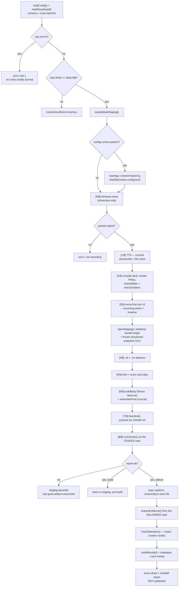

Ordering is not incidental:

- **Schema and lint errors stop the run before TTS.** A step that does not
  exist cannot be recorded, and a chapter for a scene that is not there cannot
  be timed — so there is no reason to spend voice credits finding out.
- **Voice runs before the browser** because its measured length is the clock.
- **The deck is compiled before recording** because a `slide` step navigates
  into `slides/deck.html`, and `file://` navigation is confined to that
  directory.
- **Staging opens after recording and before composition**, so everything
  written from that point derives from a frozen snapshot of the storyboard: a
  mid-flight edit to `demos/<id>.demo.json` cannot change what was checked.

---

## 7. The engine: one boot path

[`lib/engine/session.ts`](../lib/engine/session.ts) `boot()`. Fixed order, and
**every step of it is off the clock** — the recorded body opens on a settled,
signed-in, cookie-banner-free app.

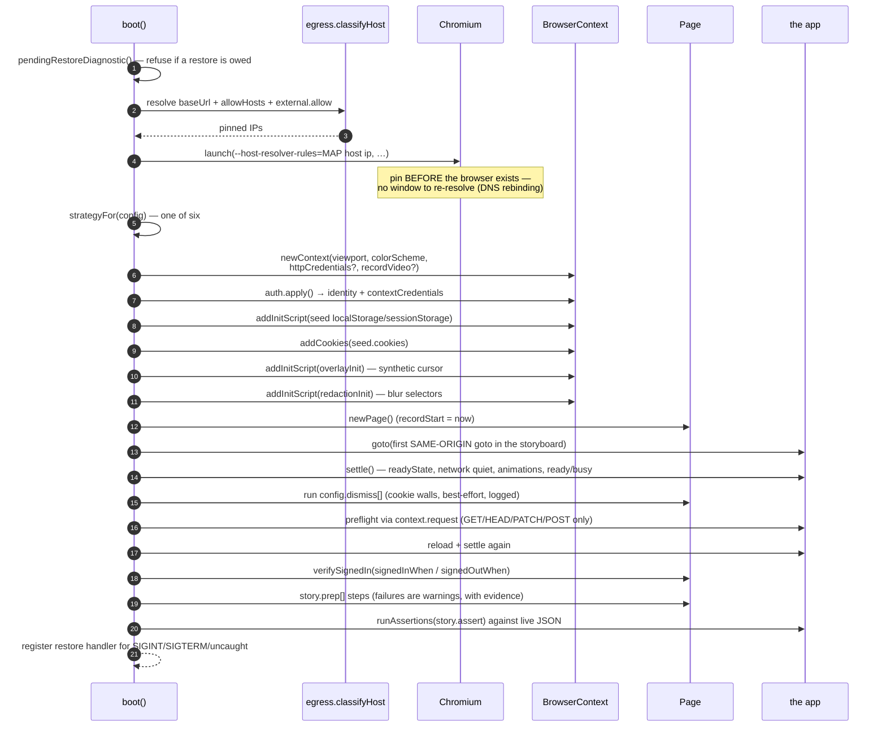

Two details worth calling out.

**Storage seeding order.** `context.addInitScript` runs *before any app script*.
The comment in the source records the hard-won lesson: when an app reads its own
storage key before it reads a server preference, seed **both** or the recording
silently comes back in the wrong theme.

**Restore registry.** Preflight can mutate the operator's real preferences.
Live sessions holding pre-state are kept in a `Set`, and `SIGINT`/`SIGTERM`/
`uncaughtException` replay every pending restore before exiting. It is a set
rather than a single captured session because `rehearse` boots **twice in one
process** — the earlier single-variable version restored the first session
twice and left the live one mutated.

---

## 8. Step execution and locator resolution

[`lib/engine/actions.ts`](../lib/engine/actions.ts) `runStep()` and
[`lib/engine/locators.ts`](../lib/engine/locators.ts).

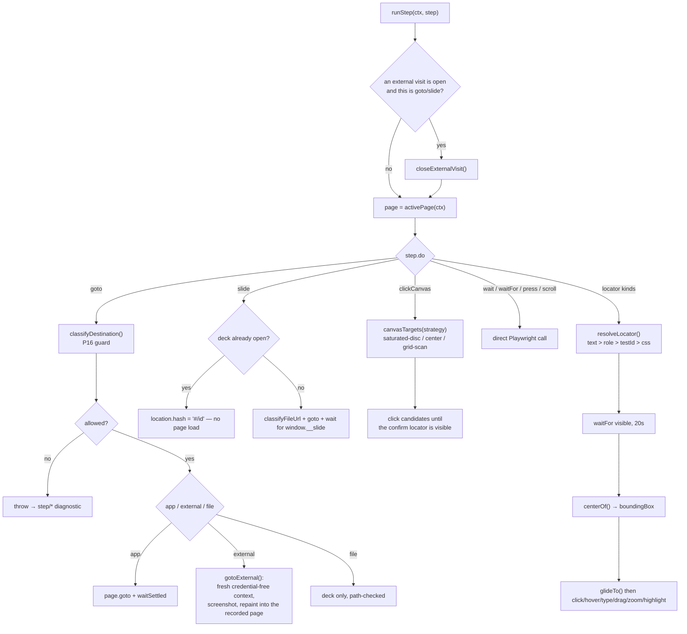

**The synthetic cursor.** A headless screencast records page content, not the
desktop, so the real OS cursor is never captured. `overlayInit`
([`lib/engine/overlay.ts`](../lib/engine/overlay.ts)) injects a shadow-hosted
overlay that draws a cursor dot following real `mousemove` events, a click
ripple and a toggleable focus ring. `glideTo()` moves it along an ease-in-out
curve over `cursorGlideMs` (650 ms) so the recording reads as a person using
the app rather than a teleporting pointer.

**`clickCanvas` and `saturated-disc`.** A force-directed graph randomises node
positions on every layout, so a fixed pixel is unreliable. The `saturated-disc`
strategy reads the canvas's actual painted pixels via `getImageData`, scores
them by saturation × brightness (nodes are saturated filled discs; links are
thin desaturated lines; labels are white), keeps the strongest hits at least
40 px apart, and clicks them in order until the `confirm` locator becomes
visible. The cursor glides only to the *first* candidate, so a miss retries
without the recording showing a hunt. Fallbacks: a centre-outward spiral when
the canvas is unreadable (WebGL / tainted).

**`suggestFixes()` — the thirty lines that collapse most repair rounds to one.**
When a step fails, the engine does not just report the failure; it gathers the
evidence needed to author the next locator:

| Locator kind that missed | Evidence collected | Fixes offered |
|---|---|---|
| `css` | `cssMatchCount` | 0 → "use text or role instead"; >1 → "add `nth`" |
| `text` | 3 nearest visible strings by **Levenshtein distance** | `use "text": "<the real string>"` |
| `role` | up to 12 accessible names for that role | `use "role"+"name"` pairs |
| any | trimmed `ariaSnapshot()` of `<body>`, 40 lines | — |

Plus a screenshot at the exact moment of failure, written to
`out/<id>/evidence/fail-<scene>-<index>.png`.

---

## 9. Readiness: "settled" as a measurement

[`lib/engine/readiness.ts`](../lib/engine/readiness.ts). The framework-agnostic
claim lives or dies here. The engine never branches on a framework; it waits on
conditions that are true of all of them.

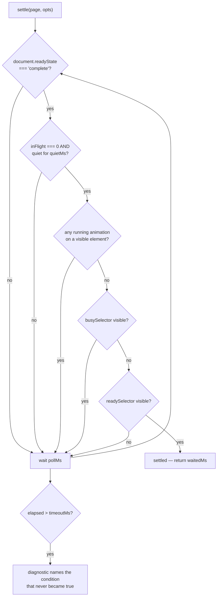

Details that matter:

- **In-flight request tracking survives navigation**: listeners are attached to
  the `Page`, not to a document, and detached in a `finally`.
- **Infinite animations are ignored.** `effect.getTiming().iterations ===
  Infinity` means a pulsing dot or a corner spinner, and a decorative loop must
  not hold the whole page hostage. Off-screen and zero-size animations are
  ignored too.
- **The failure names the condition.** `readiness/timeout` carries
  `condition: "networkQuiet" | "readyState" | "animations" | "readySelector"`
  and a matching set of `supportedFixes`. A stuck `busySelector` degrades to a
  *warning* with its own code, because the app's own spinner is a more reliable
  signal than any heuristic and its stalling is usually an app fact.
- **Two profiles.** `READINESS` (quiet 500 ms, timeout 20 s) for the app;
  `EXTERNAL_READINESS` (quiet 1200 ms, timeout 30 s) for someone else's site,
  where a never-quiet beacon becomes `external/never-settled`, a warning.

---

## 10. Egress, navigation and the credential boundary

Three files: [`lib/egress.ts`](../lib/egress.ts) (address classification),
[`lib/engine/navigation.ts`](../lib/engine/navigation.ts) (what a recording may
point at), and the `--host-resolver-rules` pinning in `session.ts`.

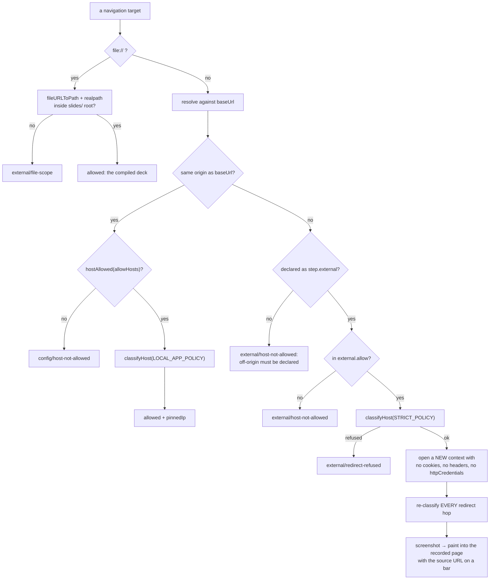

### Address classification

`classifyHost()` is a TypeScript port of a Python rule from the repository this
tool grew in, and behaviour must match so an operator does not learn two
different rules. The load-bearing decisions:

1. **Classify the resolved IP, never the hostname.** An in-scope-looking name
   can point at `169.254.169.254` or `127.0.0.1:7474`.
2. **Every resolved address must clear the policy.** A name returning one public
   and one internal address is hostile; taking the first would let it through
   half the time.
3. **Pin the address that passed and connect to that.** Re-resolving between
   check and connect is the TOCTOU hole. Chromium's `--host-resolver-rules`
   (`MAP <host> <address that passed>`) is where the pin is actually enforced.
4. **Fail closed.** Unparseable, unresolvable and IDNA errors are all refusals.

Classification is delegated to `net.BlockList`, not to string matching, and the
comment explains why: the hand-rolled matcher it replaced read
`0:0:0:0:0:0:0:1` as public, and read NAT64 `64:ff9b::7f00:1` (which reaches
`127.0.0.1`) as public. `embeddedIpv4()` extracts the inner IPv4 from
`::ffff:` mapped and `64:ff9b::` NAT64 forms and classifies *both* addresses.

Two policies, two purposes:

| Policy | private | loopback | link-local | CGNAT | reserved | multicast | Used for |
|---|---|---|---|---|---|---|---|
| `LOCAL_APP_POLICY` | allow | allow | **block** | **block** | block | block | the application origin (filming localhost is the normal case) |
| `STRICT_POLICY` | **block** | **block** | **block** | **block** | block | block | every off-origin host |

A separate `HARD_TLD_RE` guardrail refuses `.gov`, `.mil`, `.edu`, `.int` and
their national variants outright — this tool ships from an offensive-security
monorepo and must not be mistakable for reconnaissance.

`MAP * ~NOTFOUND` (`egress.strictSubresources`) is **off by default**, and
deliberately: a real app legitimately loads a font host, an avatar CDN or an
error reporter that nobody listed, and turning those into DNS failures would
break real recordings to close a hole navigation checks already cover.

### The credential boundary

The first version of the off-origin guard only cleared `extraHTTPHeaders`. But
`httpCredentials` (the `basic` strategy) is a **context-creation option that
cannot be unset**, and Playwright answers any `401 WWW-Authenticate: Basic`
with it regardless of origin — so a third party replying with a challenge
received the operator's username and password.

The fix is structural: the boundary is a **separate context that was never
given a credential**, not an attempt to take one away from a context that has
one. There is nothing to strip, which is the only version of this that is
actually true. What crosses the boundary is a **PNG screenshot**, repainted
full-bleed into the recorded page with the source URL on a bar — which is
exactly what a video needs and the least that could cross.

The visit **stays open for the rest of the scene**, and every subsequent step
that acts on it triggers `repaintExternal()`. An earlier version captured one
screenshot and closed, which silently turned every later step into a no-op — a
storyboard that scrolls a wiki page became four seconds of a still image with
nothing saying so.

---

## 11. The voice is the clock

[`lib/compose/tts.ts`](../lib/compose/tts.ts) and
[`lib/compose/alignment.ts`](../lib/compose/alignment.ts).

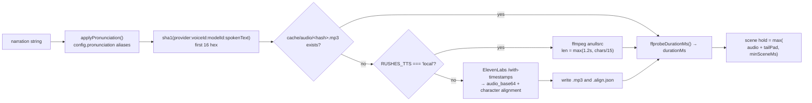

- **The provider is in the cache key on purpose**: switching between the hosted
  and the local voice must not silently reuse the wrong clip.
- **The cache lives under the skill**, not the project — the same line in two
  projects is the same audio, and a project checkout should not carry tens of
  megabytes of mp3.
- **`RUSHES_TTS=local`** produces correctly-*timed* silent clips. Fine for a
  rehearsal, a CI re-render or a draft cut; never for something you publish.

### Word-anchored slide beats

A `Beat` anchors to a **word**, not a millisecond:

```jsonc
{ "on": "broker", "occurrence": 1, "do": "focus", "target": "bus" }
```

`with-timestamps` returns per-character start times in the same call as the
audio, so `wordOffsetMs()` finds the `occurrence`-th whole-word match in the
alignment's own character stream (which may differ from the caption text
because of pronunciation aliases) and returns its start offset.

Two properties fall out that hand-timed animation never has:

1. **Re-recording re-syncs automatically.** A reworded sentence or a different
   voice moves every beat correctly, with no storyboard edit.
2. **A beat that never fired is a diagnostic** (`slide/beat-not-reached`), not
   something you notice on the fourth viewing.

Fallback when there is no alignment (a cached clip from before timestamps, or
the local voice): the word's character position in the sentence scaled by the
~15 chars/second speaking rate. Less exact, still monotonic, and better than
firing everything at zero.

The lint enforces the contract at author time: an anchor that does not appear
in the narration is `slide/beat-anchor-missing`; an anchor appearing more than
once with no `occurrence` is `slide/beat-anchor-ambiguous`; beats on a scene
with no `slide` step is a step-arg mismatch.

---

## 12. The slide subsystem

Five files: `compile.ts`, `blocks.ts`, `render.ts`, `check.ts`, `geometry.ts`,
plus `repair.ts`, `tokens.ts`, `imagediff.ts` and the browser runtime in
`slides/runtime/`.

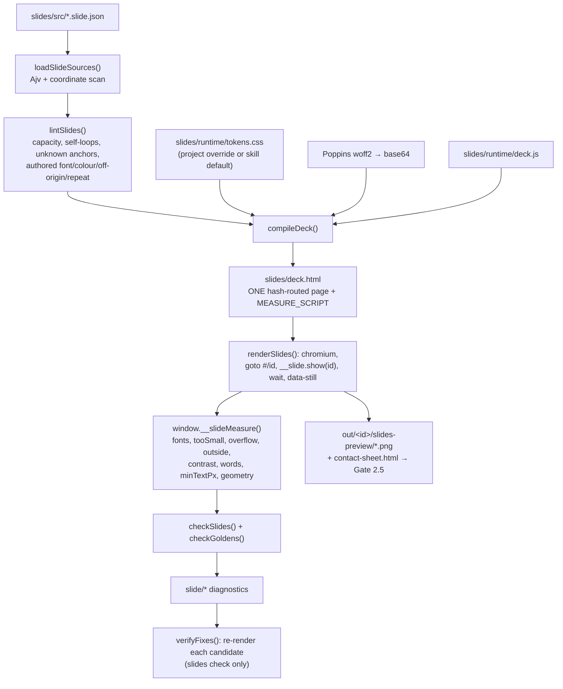

### Why one deck instead of N standalone files

The compiled `slides/deck.html` replaces what used to be twenty standalone
files sharing a byte-identical first 600 characters, re-embedding the same logo
ten times, and — in seventeen of twenty cases — silently falling back to
whatever typeface the machine happened to have, *which nobody noticed because
nothing measured it*.

One deck unlocks three things the slide half actually needed: shared-element
morphing between slides (`document.startViewTransition`), persistent state so a
later slide can add a layer instead of redrawing the system, and a crossfade
instead of a hard cut.

**The compiled deck is a build artifact.** The source of truth is
`slides/src/*.slide.json`.

### Connectors are drawn, not predicted

`deck.js` draws connectors **after layout**, from `getBoundingClientRect()`.
Routing stays trivial because each block constrains topology — `flow-row`
connects adjacent boxes, `sequence` connects participant to participant, `hub`
connects centre to satellite — so there is never an obstacle to route around,
which is the entire reason this needs no solver.

Beyond drawing the line, the connector pass:

- **fans out coinciding ports** (`spreadPorts`) so two relationships leaving one
  box read as two, not as one thick arrow;
- **places each label where it covers nothing**, trying four alternatives;
- **samples the drawn stroke off the SVG path** and publishes it as
  `window.__slideGeometry`, so the checker measures the picture rather than a
  prediction of it.

[`lib/slides/geometry.ts`](../lib/slides/geometry.ts) then analyses that sample
for four measurable defects (ported in spirit from `archify`, MIT):

| Issue | Code | Severity | Meaning |
|---|---|---|---|
| `edge-through-node` | `slide/edge-through-node` | **error** | a route passes through a box it does not connect — it states a relationship nobody authored |
| `route-crossing` | `slide/route-crossing` | warning | two unrelated routes properly cross |
| `route-corridor` | `slide/route-corridor` | warning | two unrelated routes run together closer than the gap for longer than the run |
| `label-node` / `label-route` / `label-label` | `slide/label-clearance` | warning | a connector label covers a box, a route or another label |

None of the repairs for these deletes a label or a connector. A label is
semantic data; a diagnostic may propose *shortening wording* when the wording
is what does not fit, and may never propose deleting meaning as a geometry
repair.

### Projected readability

The 22 px floor (`slideMinFontPx`) is measured in the 1920-wide authoring
frame. But the slide is watched inside a video player that is routinely 640 px
wide, where 22 px arrives as ~7 px. So a second check projects:

```
projectedPx = sourcePx × (viewingWidthPx / frameWidth)      # 640 / 1920
requiredSourcePx = frameWidth / viewingWidthPx × 10 px       # ≈ 30 px
```

`slide/text-projected-too-small` is a warning on the named exception list — it
is a house standard, not a defect in the artifact.

### Golden frames

`checkGoldens()` compares each rendered PNG to a checked-in
`slides/golden/<id>.png`, **perceptually**. It used to be `Buffer.equals`,
which sounds strict and is useless: one re-encoded pixel or a font-hinting
difference between two machines flips it, and a check that cries wolf every run
is a check people learn to ignore. Now two pixels differ only when a channel
moves by more than `slideGoldenChannelTolerance` (8), and a slide fails only
when more than `slideGoldenPixelRatio` (0.2 %) of pixels differ. The comparison
runs **in the browser already shipped**, so no PNG decoder joins the three
dependencies. Re-pinning is `--update-golden`: deliberate, never automatic,
because a golden that updates itself measures nothing.

### Preview vs recording: motion

`renderSlides()` sets `document.documentElement.setAttribute('data-still', '')`
before measuring — the preview and the golden must be deterministic. **The
recorder never does this**, so a filmed slide stays fully animated. This is
also why `freezeSpans()` in the mux explicitly skips any scene containing a
`slide` step: a slide animates *throughout* its narration (its beats fire
during the hold, after `actionEndMs`), so freezing at `actionEndMs` would
record all of that and then throw it away.

---

## 13. The recorder and the timeline

[`lib/engine/driver.ts`](../lib/engine/driver.ts) `record()`.

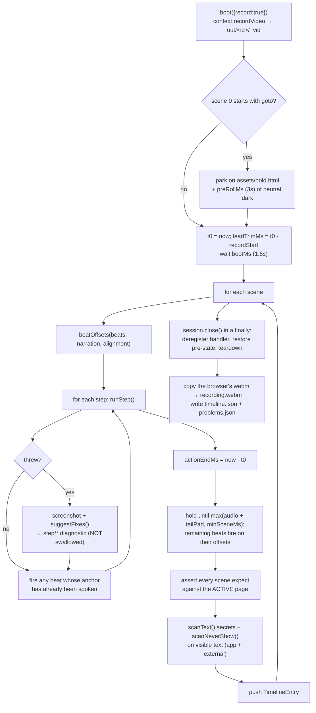

**The change that matters** (quoted from the source header): step failures are
no longer swallowed. The old code caught every exception, printed a line nobody
read, ran the scene's full hold, pushed the timeline entry anyway and told the
build nothing — *so a storyboard where every locator was broken produced a
complete, correctly narrated, correctly captioned video of a page that never
changed.*

Three more properties of this loop:

- **The pre-roll exists because a change-driven screencast is not linear with
  wall clock.** The browser emits a frame only when the page repaints, so the
  `leadTrimMs` trim is approximate and the boot page used to leak into the top
  of the body. Parking on a neutral dark frame first makes whatever leaks
  harmless. (`test/timing.test.mjs` is the golden test that measures the
  non-linearity: white flashes at 0/5/10/15 s, decoded and compared against
  where the page says it painted them.)
- **`expect` is asserted against `activePage(ctx)`** — a scene that ends on an
  off-origin page must be able to claim what is visible there.
- **The privacy scan runs per scene**, over the app's `innerText` plus any
  external page's text, and a hit on the app is an **error at every profile**.
  A secret on screen in a video destined for a public channel is an incident,
  not a bug.

---

## 14. Composition: captions, cards, mux

### Captions are sidecars, never burned in

[`lib/compose/subtitles.ts`](../lib/compose/subtitles.ts). Narration is split
into sentences (short fragments folded into the previous cue), distributed
across the scene's **audio** window by character length, wrapped at 54 chars,
and shifted by the intro card's duration. `.vtt` goes to YouTube as a real
caption track (toggleable, translatable, indexed for search); `.srt` is what
LinkedIn's uploader accepts.

Burning pixels would cover the very interface the video exists to show, and
could never be turned off or translated.

### The mux

[`lib/compose/mux.ts`](../lib/compose/mux.ts). Two ffmpeg invocations.

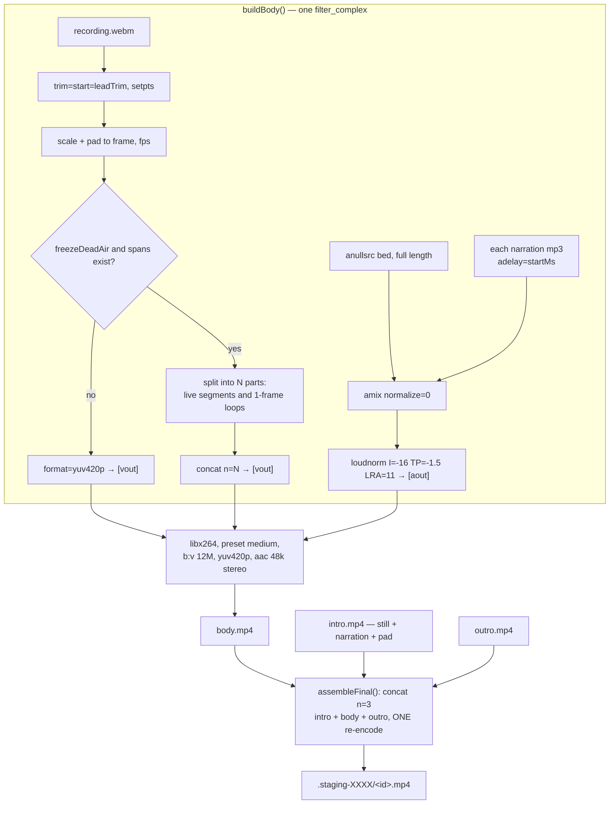

**The freeze (`freezeSpans`).** Where a scene's audio outlasts its actions, the
final frame of the action span is held for the remainder instead of recording
live idle. Total duration is unchanged **by construction**, so every timeline
offset, caption cue and chapter timestamp stays valid — the picture simply
stops moving instead of showing a spinner or a jerky software render while the
voice finishes the sentence. `loop` counts frames, so the held length is exact
at the constant rate the previous filter already imposed.

Slide scenes are excluded (see §12).

**Loudness.** The narration bed is normalised to −16 LUFS. Whatever level the
voice provider returned drifts between voices and models; a platform will
normalise on its side anyway, and arriving already correct stops its transcode
fighting the mix. `audio_loudness` then measures the result at −18…−14 LUFS.

**Determinism.** `--bitexact` (used by `recut --bitexact` and
`test/determinism.test.mjs`) adds `-fflags +bitexact`, bitexact stream flags and
`-map_metadata -1`, removing the encoder version string and timestamps. What is
left is the actual encode: two muxes of the same inputs must produce identical
bytes.

---

## 15. Validation: three tiers, one registry

Rushes validates in **three separate tiers that are never conflated**, plus a
per-scene assertion layer.

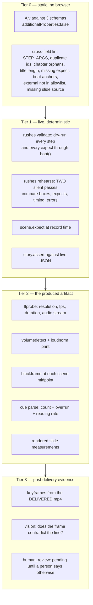

### The registry and the profile rule

[`lib/check/registry.ts`](../lib/check/registry.ts) declares 45 checks, each
with a severity **per quality profile**:

```ts
{ name: 'steps_resolved', measures: '…', standard: 'warn', showcase: 'error' }
```

`levelFor(spec, profile)` implements the **fail-closed rule (SP7)**:

> At the `showcase` profile, a check that is not on the `DEGRADABLE` exception
> list may not be softer than an error, whatever its row says.

`DEGRADABLE` is a literal `Set` of seven names — `audio_loudness`,
`caption_reading_rate`, `slide_word_count`, `slide_golden`,
`slide_authored_fidelity`, `slide_label_clearance`,
`slide_projected_readability`. A future check that wants to degrade must be
added to that list **explicitly**, which is the point of writing it down rather
than leaving it to each check's own opinion.

The profile and the check count both go into the receipt, so a run that
measured less can never be reported as a showcase pass.

### How `runChecks()` composes its verdict

[`lib/check/index.ts`](../lib/check/index.ts) takes the produced mp4, its
sidecars, the timeline and **the accumulated diagnostics from every earlier
stage**, and turns them into `{ name, ok, level, details[] }` rows.

Most checks are a **projection of diagnostics by code**:

```ts
const stepErrors = problems.filter(p => p.code.startsWith('step/') && p.severity === 'error');
add('steps_resolved', stepErrors.length === 0, stepErrors.map(…));
```

A handful **measure the file directly**:

| Check | Measurement |
|---|---|
| `video_stream` | `ffprobe` width/height/fps/`hasAudio`, and duration within 60 s of `intro + last endMs` |
| `audio_present` | `volumedetect` mean between −30 and −6 dB |
| `audio_loudness` | `loudnorm` print, integrated LUFS in −18…−14 |
| `no_black_scene` | `blackframe=amount=0:threshold=32` on the frame at each scene's midpoint; ≥ 98 % black fails |
| `captions_aligned` | parses the `.vtt` cues; fails if empty or if the last cue ends > 500 ms past the video |
| `caption_reading_rate` | any cue over 20 chars/second |
| `secret_scrub` | serialises every diagnostic and searches it for a registered secret value |
| `env_allowlist` | the skill's `.env` carries only the two voice keys |
| `no_pending_restore` | `.rushes/pending-restore.json` is absent |
| `receipt_auditable` | baseUrl, auth strategy, id, publishConsent, identity, hostsContacted all present |

Two rows are honest about *not* measuring:

- `engine_neutral` reports `not measured per build; enforced by node test/run.mjs neutrality`. Reporting it as a pass would be claiming a measurement that did not happen.
- `narration_check` reports `not run` when the vision result is absent.

The summary is `{ errors, warnings, checks: "passed/active", ran, total }` and
**`ok === (errors === 0)`**, counting only rows whose level is not `ignore`.

### The rehearsal

[`lib/check/rehearse.ts`](../lib/check/rehearse.ts) is a strictly better answer
to "is the timing model trustworthy" than a one-off golden test, because it
validates determinism on **the run you are about to ship** rather than once, in
the past, on a fixture.

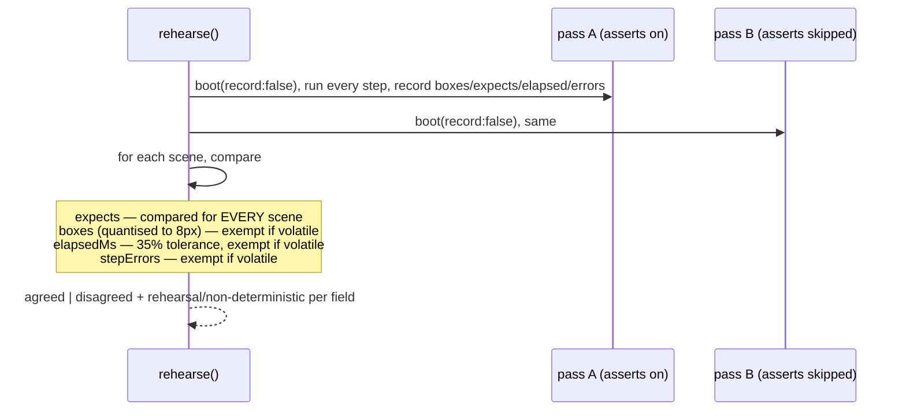

A scene marked `volatile` (or any external scene when `external.volatile` is
set) is exempt from box and timing equality — a third party's page carries
rotating content and the two passes would disagree forever. **It must still
satisfy its `expect`**, and the exemption is written into the receipt so a
green rehearsal is not overclaimed.

### The narration vision check

[`lib/check/vision.ts`](../lib/check/vision.ts). For each scene: the keyframe
from the **delivered** video plus the sentence the voice says over it, and one
closed question.

The containment is in **code**, not in a sentence of the prompt — a page under
recording can contain text written by whoever controls the data it displays,
and that text reaches a model as an image, so prompt injection is expected:

- the call is bound to **no tools**;
- `max_tokens: 8` — one word; nothing longer can be a useful answer;
- `parseVerdict()` accepts exactly three tokens at the start of the reply:
  `CONTRADICTS` → `unverified`, `CONSISTENT` → `verified`, `UNSURE` →
  `inconclusive`. **Anything else — including a perfectly well-formed sentence
  explaining why it should be trusted — becomes `inconclusive` and steers
  nothing.**

No `ANTHROPIC_API_KEY` means every scene is `inconclusive`, and the report says
so out loud rather than implying the scenes were checked.

---

## 16. Atomic delivery, the receipt and the publish gate

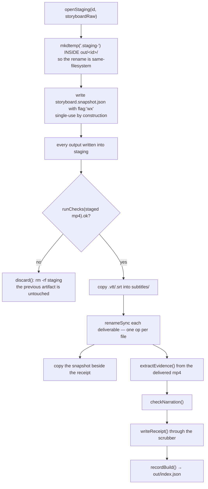

Three properties, each of which was a real failure before:

1. ffmpeg used to write straight to `<id>.mp4`, so an interrupted or degraded
   run silently replaced a good cut with a worse one.
2. The commit is **one same-filesystem rename per file**, so there is no window
   in which half a video is the deliverable.
3. The storyboard bytes are frozen with `flag: 'wx'` before anything is built,
   and the build reads the snapshot — a mid-flight edit cannot change what was
   checked.

Stale `.staging-*` directories from a killed run are swept at the start of the
next build.

### The publish gate

[`lib/publish/gate.ts`](../lib/publish/gate.ts). Before this existed, the only
thing standing between a rendered file and a public upload was
`existsSync(<id>.mp4)`.

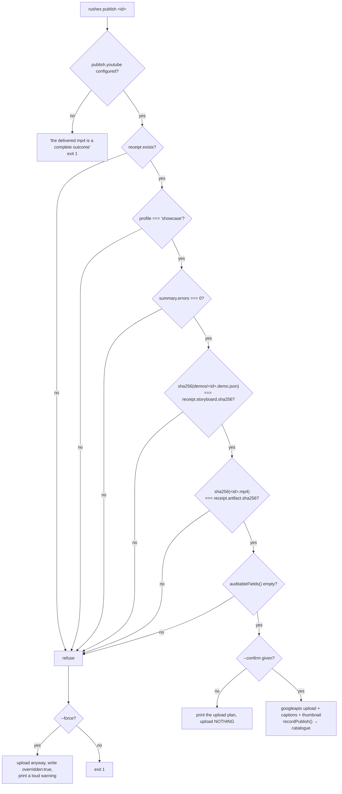

The **storyboard clause closes a live hole**, not a theoretical one: you could
edit the storyboard after recording, regenerate `youtube.txt` from the new one,
and upload chapter timestamps that did not match the video.

### The catalogue

[`lib/publish/catalogue.ts`](../lib/publish/catalogue.ts) writes one line per
demo into `out/index.json`. `staleEntries()` answers the question that actually
matters once there are dozens of published videos and an app under active
development: **which published videos were built from a storyboard that has
since changed.** `rushes rerun <id>` then re-records and reports, per scene,
what moved — using a scaled-down mean-absolute-difference between the new and
the previously delivered evidence frames.

---

## 17. The diagnostic protocol and the repair loop

Failures are structured data, not prose
([`lib/diagnostics.ts`](../lib/diagnostics.ts)):

```ts
interface Diagnostic {
  code: string;                        // stable, registry in references/delivery-contract.md
  severity: 'error' | 'warning';
  message: string;
  subject: Record<string, unknown>;    // sceneId, stepIndex, slide, host, …
  evidence: Record<string, unknown>;   // screenshot, url, waitedMs, visibleAlternatives, ariaTree
  supportedFixes: string[];            // THE load-bearing field
}
```

`supportedFixes` is what makes the agent loop **converge instead of thrash**:
the agent picks from it and never invents a value.

`Diagnostics` de-duplicates by `(code + message + subject)` — one root cause
touching forty elements produces one line, not forty — and `toJSON()` runs
every item through the secret scrubber before it is written.

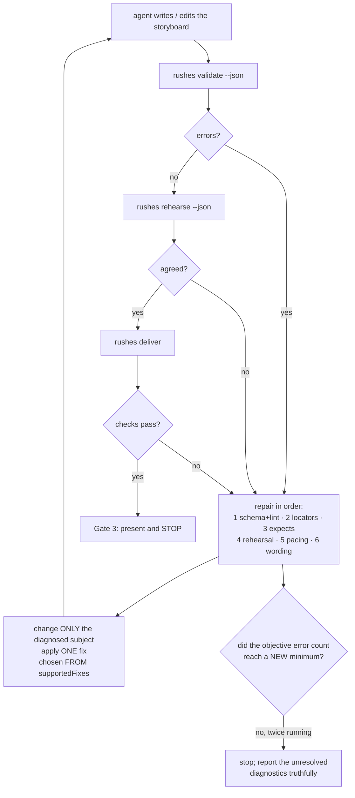

### Verified repairs for slides

[`lib/slides/repair.ts`](../lib/slides/repair.ts) goes one step further: instead
of hoping a suggested fix works, it **proves it**.

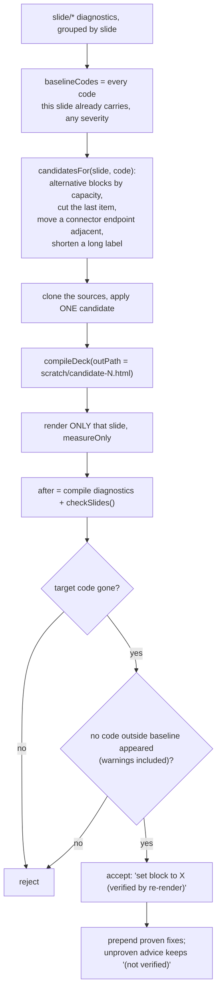

Design decisions worth noting:

- **Budget.** `CANDIDATE_BUDGET = 10` per *slide*, split across its codes
  (`candidateBudgetFor`). It used to be per-code, which is not a budget: a
  slide with five findings authorised five budgets and turned a check into a
  coffee break.
- **Per-code verification.** A slide with two unrelated defects would otherwise
  prove nothing, because no single edit clears both.
- **Warnings count.** Checking only errors let the loop verify "set block to
  `badge-list`", which cleared a label collision by moving to a block with no
  topology and silently earned a `slide/mode-mismatch` instead.
- **A fresh deck path per candidate**, plus a `page.reload()` when the URL is
  unchanged — a held-open renderer serving an already-parsed document would
  measure the *previous* candidate and make every "verified" fix after the
  first a lie.
- It runs during `slides check` (where an author is iterating), **not** during
  `deliver`, whose job is to refuse rather than to repair.

---

## 18. The security model

| Concern | Mechanism | Code |
|---|---|---|
| Arbitrary code execution via a cloned repo's `runner.start` | Never auto-run. Print the command, cwd and config sha256; require a typed `yes`; record consent **keyed by that sha256**, so any config edit invalidates it. Refuse outright when stdin is not a TTY or under `--non-interactive`. | `lib/runner/index.ts` |
| Authenticated request forgery via `preflight` | Only `GET`/`HEAD`/`PATCH`/`POST`. Absolute URLs, scheme-relative `//` and any `..` segment are refused. | `lib/engine/preflight.ts` |
| Losing someone's preferences to a Ctrl-C | Pending restores are persisted **before** they are applied; signal handlers replay them; the next run refuses to start while a leftover file exists; the restore is a **compare-and-set** that aborts (and reports) if the value changed under us. | `lib/engine/preflight.ts` |
| SSRF / metadata / DNS rebinding | Resolved-IP classification with every address checked, address pinned into `--host-resolver-rules`, every redirect hop re-classified. | `lib/egress.ts`, `lib/engine/navigation.ts` |
| Credential leak off-origin | A brand-new context with no cookies, no headers and no `httpCredentials`; only a PNG crosses. | `lib/engine/navigation.ts` |
| Local file exfiltration via `file://` | Allowed by **path**, not by scheme: `realpath`-resolved and required to be inside `slides/`. | `classifyFileUrl()` |
| Secrets in logs / receipts | Register by value at the secret positions; scrub every diagnostic and the receipt at write time; then `secret_scrub` re-serialises everything and searches it, so the scrubber itself is measured. | `lib/secrets.ts` |
| Secrets on screen | 11 key-shaped patterns scanned against visible text per scene; **error at every profile**; the excerpt keeps 4 characters of shape and never echoes the match. | `lib/secrets.ts` |
| The skill accumulating other systems' secrets | The skill's `.env` allowlist is exactly `ELEVENLABS_API_KEY` and `ELEVENLABS_VOICE_ID`; anything else is `config/env-leak`. An app credential is a `${VAR}` in the project config, or a browser state file the user owns. | `lib/env.ts` |
| A browser state file being a bearer credential | Written `0600`, never copied into `out/`, never in a receipt, and never in the packaged payload (which is built from git-tracked files only). | `lib/auth/index.ts`, `scripts/stage-clean-skill.mjs` |
| Prompt injection through recorded pixels | No tools, `max_tokens: 8`, three-token parser. | `lib/check/vision.ts` |
| Recording as a human operator's account | `recording_identity` fails when the identity is on `recordingIdentity.operatorAccounts`. | `lib/check/index.ts` |
| Publishing something unsafe | `publish_consent` is an error at every profile; the consent string is recorded in the receipt; Gate 4 requires a new user message. | `lib/check/index.ts`, `SKILL.md` |
| Silently filming a logged-out app | `auth/state-expired` (default 168 h), plus `verifySignedIn()` with `signedInWhen`/`signedOutWhen`. | `lib/auth/index.ts` |

### The six auth strategies

All behind one `apply(context, config)` interface, so the engine knows nothing
about which one ran.

| Kind | How | Identity recorded | Notes |
|---|---|---|---|
| `none` | — | `anonymous` | public sites |
| `storage-state` | replay cookies + localStorage captured by `rushes login` | `storage-state:<path>` | **the recommended default**; works with Django, Rails, Laravel, Next.js, SSO, TOTP — the skill never sees the credential |
| `form-login` | fill named fields on a **separate page**, closed before recording | the username field | a login surface must never coexist with the recorded page (a screenshot cannot be redacted) |
| `jwt-cookie` | HS256 mint from `${SECRET_ENV}` into a named cookie | the `sub` claim | secret and token both registered with the scrubber |
| `basic` | `httpCredentials` at context creation | the username | unscoped by construction → the origin boundary must be a new context |
| `header` | `setExtraHTTPHeaders` | `header:<name>` | withheld off-origin |

---

## 18b. Portability: one file knows about the OS

Linux, macOS and Windows are all supported, and the support is structured rather
than incidental: **every OS-dependent decision is made in
[`lib/platform.ts`](../lib/platform.ts)** and nowhere else.

There are exactly five seams where this code leaves Node for the operating
system, and each behaves differently on the three platforms:

| Seam | POSIX | Windows | Why it cannot be shared |
|---|---|---|---|
| find a binary | `which` | `where` (prints every match; only the first runs) | `which` does not exist on Windows, so ffmpeg, ffprobe and the browser all read as absent |
| run a command string | `/bin/sh -c` | `cmd.exe /d /s /c` | hardcoding `sh` meant `rushes setup` — the command whose job is to install things — could not run |
| stop a process **tree** | `kill(-pid)` on the process group | `taskkill /pid N /T` | the server is the shell's grandchild; killing the child leaves it holding the port. Windows has no process groups and `kill(-pid)` throws |
| ask for available memory | `os.freemem()` | `os.freemem()` | on **macOS** `freemem()` counts only genuinely free pages and excludes the inactive, speculative and purgeable pools, so a 32 GB Mac reports a few hundred MB and the recording floor refuses on a healthy machine. `vm_stat` is parsed there instead |
| path ↔ URL | `pathToFileURL` / `fileURLToPath` | same | `` `file://${path}` `` is wrong on Windows twice over, and `new URL(import.meta.url).pathname` yields `/C:/Users/…`, which made every skill-relative path unresolvable |

Two more platform facts are settled in the same module:

- **`CASE_INSENSITIVE_FS`** — the `file://` containment check folds case on macOS
  and Windows, because their default filesystems do. Comparing case-sensitively
  there would not tighten the boundary; it would refuse a path that genuinely is
  inside it.
- **`stateProtection()`** — `chmod 0600` is effectively a no-op on Windows, so
  `rushes login` reports what the filesystem actually enforces instead of
  printing "mode 0600" where that is not a true statement about the file.

### How it is kept true

`test/portability.test.mjs` is the same shape as the neutrality suite: it strips
comments from every file in `lib/`, `bin/`, `test/` and `scripts/`, then greps
for the six POSIX-only forms and fails if one appears outside
`lib/platform.ts`. It also asserts that the path-to-URL round trip holds, that
the containment check agrees with the filesystem on case, that the browser is
looked for under names the running platform actually uses, and that the runner
still spawns and stops through the two tree-aware helpers.

A grep proves a construct is absent, not that the thing runs — so CI runs the
suite on `ubuntu-latest`, `macos-latest` **and** `windows-latest`: the fast
suites plus `doctor` on a bare machine in one job, and then the browser-and-
ffmpeg suites (conformance, timing, determinism, slides, hardening, security)
on all three after provisioning.

## 19. Tests, CI and packaging

`node test/run.mjs [substring]`. No framework — the runner is 30 lines, the
assertions another 30.

| Suite | ~n | What it proves |
|---|---|---|
| `unit` | 38 | pure functions: env refs, chapters, cue timing, egress classification, JSON paths, brand resolution, title branding, scrubber |
| `hardening` | 25 | the failure modes above: consent keying, restore compare-and-set, staging atomicity, gate clauses |
| `security` | 11 | resolver pinning actually blocks a second name for this machine; file-scope; credential boundary |
| `portability` | 10 | **grep the source for POSIX-only constructs and find none outside `lib/platform.ts`**, plus the path/URL round trip, the case rule and the browser candidate list |
| `neutrality` | 13 | **grep the engine for a product's identifiers and find nothing** — principle 10 as a test rather than a promise; also the two-key `.env` rule and "no captured state in the payload" |
| `slides-hardening` | 15 | capacity, coordinate refusal, authored-mode lints |
| `slides-runtime` | 5 | the deck's public API and connector drawing |
| `slides-motion` | 4 | motion is not frozen where it must not be |
| `geometry` | 7 | crossings, edge-through-node, corridors, label clearance, projected readability |
| `conformance` | 2 (×4 cases) | three fixture *shapes* — static, SSR+CSRF form login, SPA that fills in after a fetch — plus **an app that never settles must produce `readiness/timeout` naming the condition, not a video of a spinner** |
| `timing` | 1 | the golden timing test: is the recorded timeline linear with wall clock? |
| `determinism` | 2 | two bit-exact muxes of the same inputs produce the same bytes |
| `readme` | 8 | the four generated README blocks have not drifted from the code |

The conformance fixtures are deliberately **not** Django and **not** Next.js.
What they reproduce is the *behaviour* that breaks a framework assumption. An
engine that survives both survives the frameworks that have those shapes.

CI ([`.github/workflows/ci.yml`](../.github/workflows/ci.yml)) runs a **three-OS
matrix**. A `check` job on Linux, macOS and Windows does `type-check` →
`unit` + `neutrality` + `portability` → `geometry` + `slides-hardening` →
`readme` → `doctor` on a bare machine (an absent tool must report as unavailable,
never as a false pass). An `integration` job then provisions ffmpeg and chromium
per platform and runs `conformance` → `timing` → `determinism` → the slide
runtime suites → `hardening` + `security`, again on all three. A third job proves
the **packaging is byte-deterministic**: stage from git-tracked files only, zip
twice, `cmp`. Sorted entries, fixed DOS timestamps, and a pinned Node major
(zlib output varies between majors).

`benchmark/run.mjs` scores a "first-pass usable" benchmark by running gates 1
and 2 and reporting gate 3 as **PENDING** — it will never mark a case passed on
a human's behalf, which is the same rule the receipt follows.

---

## 20. Sharp edges found while reading the code

These are observations from this pass over the source, not reported bugs.
Worth verifying before relying on the behaviour either way.

1. **`recording.identity` is never populated.** `buildAndDeliver()` passes
   `identity: null` to `runChecks()` and writes `identity: null` into the
   receipt ([`lib/cli/deliver.ts`](../lib/cli/deliver.ts) L209, L268), and
   `RecordResult` ([`lib/types.ts`](../lib/types.ts)) has no `identity` field
   to carry `session.identity` out of `boot()`. Consequence: for any project
   where `auth.kind !== 'none'`, both `recording_identity` and
   `receipt_auditable` fail — at **every** profile, since both are hard errors
   — which also blocks the publish gate. Threading `session.identity` through
   `RecordResult` would close it.

2. **The vision check runs *after* the atomic commit.** In `deliver`, the order
   is `runChecks()` → commit → `extractEvidence()` → `checkNarration()` →
   `writeReceipt()`. So `runChecks()` is called with `narrationCheck`
   undefined, the `narration_check` row reports `not run` and passes, and
   `report.summary.errors` — the number the publish gate reads — was computed
   before any frame was compared to its narration. A contradiction still lands
   in `receipt.diagnostics` as `scene/narration-contradicted` and in
   `handoffReport` as `narration_check: unverified`, and re-running
   `rushes check <id>` *does* fail (it feeds the receipt's `narrationCheck`
   back in). But within a single `deliver`, the vision verdict is recorded
   rather than gating.

3. **`tool.version` is hardcoded `'1.0.0'`** in the receipt
   ([`lib/cli/deliver.ts`](../lib/cli/deliver.ts) L257) while `package.json`
   and `skill-release.json` say `1.0.6`. `tool.commit` is the real identifier.

4. **`step/locator-ambiguous` is in the documented registry**
   (`references/delivery-contract.md`) but is never emitted by `lib/`. The
   ambiguity signal exists — `suggestFixes()` reports `cssMatchCount > 1` and
   suggests `nth` — it just travels under a different code.

5. **`slide_source_truth`** ("generated slide content matches the repo it was
   derived from") is fed only by `slide/source-drift`, which today is raised
   for a missing `.slide.json` and for an unmeasurable slide. The
   repo-derivation half of the description has no producer.

6. **`intro.mp4` / `outro.mp4` are written to `out/<id>/`, not into staging.**
   `renderCardClip` uses `demoPaths(id)`, so a failed run leaves the previous
   run's card clips replaced even though the deliverable is untouched. They are
   sweepable intermediates, so the blast radius is small.

---

## 21. Where a change goes

| You want to | Change |
|---|---|
| support a new way of signing in | [`lib/auth/index.ts`](../lib/auth/index.ts) + `schemas/config.schema.json` + a conformance case |
| support a new UI action | `StepKind` in [`lib/types.ts`](../lib/types.ts) + `STEP_ARGS` in [`lib/storyboard.ts`](../lib/storyboard.ts) + a `case` in [`lib/engine/actions.ts`](../lib/engine/actions.ts) + the schema |
| make the engine wait for something new | `settle()` in [`lib/engine/readiness.ts`](../lib/engine/readiness.ts) — **never a fixed timeout** |
| add a slide arrangement | `CAPACITY` in [`lib/slides/types.ts`](../lib/slides/types.ts) + `renderBlock` in [`lib/slides/blocks.ts`](../lib/slides/blocks.ts) + `blocks.css` |
| add a check | [`lib/check/registry.ts`](../lib/check/registry.ts) (with a severity per profile) + the measurement in [`lib/check/index.ts`](../lib/check/index.ts) |
| change what a receipt records | [`lib/check/receipt.ts`](../lib/check/receipt.ts) + `auditableFields()` |
| change how a video is cut | [`lib/compose/mux.ts`](../lib/compose/mux.ts) |
| do anything that differs per operating system | [`lib/platform.ts`](../lib/platform.ts), and nowhere else — `test/run.mjs portability` fails if it escapes |
| add a CLI command | `COMMANDS` in [`lib/cli/commands.ts`](../lib/cli/commands.ts) + a `case` in [`bin/rushes.mjs`](../bin/rushes.mjs) + `node scripts/build-readme.mjs` |

### Two things duplicated on purpose

- **The egress rule** is a port of `ip_denylist.py` from the repository this
  tool grew in. Behaviour must match so an operator does not learn two
  different rules. When one changes, change both, and say so.
- **The JWT minting** exists in the app, in that repository's e2e harness, and
  here as a generic strategy. Sharing code with the e2e harness would couple
  the skill to a monorepo it must stay independent of.

### The rule that keeps it portable

> **Nothing in `lib/`, `bin/` or `schemas/` may be meaningless when filming a
> Django admin panel.**

Product-specific vocabulary belongs in `rushes.config.json`, never in the
engine or a schema. `rushes init` may *detect* a framework in order to
scaffold; the engine must never branch on one at run time. The moment there is
an `if (isNextJs)` in the engine, portability is a claim rather than a
property — and `test/neutrality.test.mjs` greps for exactly that.
